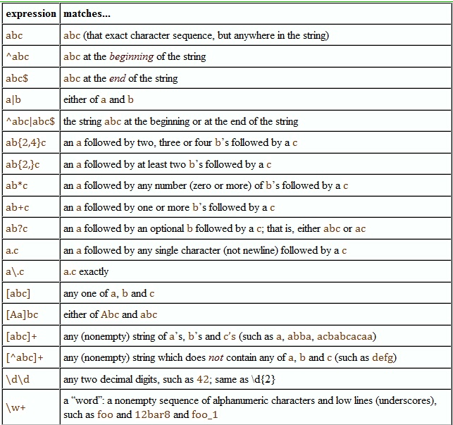

Everything in R is an object, which has a type and belongs to a class. There are functions that will help you figure out what it is you are working with

```{r}
3+5

typeof(3)

class(3)

typeof(`+`)
```

The \textbf{str} function  does a really good job of telling you what the type and structure of an object is. Use it frequently ! (I do).

```{r}
myvec <- 1:10

str(myvec)

 
str(mtcars)
```

## Variable Types

There are four primary variable classes: numeric, character, dates, and factors. First we will look at numeric data types.

```{r}
var1 <-3

var1


sqrt(var1)

var1 <- 33.3

str(var1)

var1 + var1


var1 * var1

```

There is a difference between real and integer values. If you have programmed in strongly typed languages before coming to R it is important to know.

```{r}
aa <- 5
str(aa)
aa <- as.integer(aa)

str(aa)

aa <- 5.67
as.integer(aa)
```

### Character Variables

Character strings usually represent qualitative variables. Many R functions will usually convert character variables into factors if necessary but not always. (We will discuss factors soon enough) 
 

```{r}
var.one <- "Hello there ! My name is Steve."

var.two <- "How do you do ?"

var.one

nchar(var.one) # Number of characters present

toupper(var.one)

```

Character strings usually represent qualitative variables. Many R functions will usually convert character variables into factors if necessary but not always. (We will discuss factors soon enough) 

```{r}
mydna <- c("A","G","T","C","A")

str(mydna)

mydna

pi <- "3.14"
str(pi)
 
# pi + pi
```

```{r}
paste(var.one, var.two)

paste(var.one, var.two, sep=":")

strsplit(var.one, " ")

patientid <- "ID:011472:M:C" # Encodes Birthday, Gender, and Race

strsplit(patientid, ":")

bday <- strsplit(patientid, ":")[[1]][2] # Get just the birthday

```

## Dates

R has a builtin function called Sys.Date() that can tell you the date. It looks like it returns just a character string but it returns a true date object. (Use \textbf{str} when in doubt). But Sys.Date() doesn't help us convert strings to dates. 

```{r}
Sys.Date()

Sys.Date() + 1

str(Sys.Date())
```

So unless you tell R that a string is in fact a ``real'' date it will assume that it is simply a character string. 

```{r date1}
somedate <- "03/17/99"

str(somedate)
 
# somedate+1

realdate <- as.Date("03/17/99","%m/%d/%y")

str(realdate)

realdate+1
```


R has multiple functions and packages to handle dates which can be confusing to the newcomer. The following chart attempts to summarize them and present their respective capabilities.


| function     | Package    | Dates     |  Times | Timezones |
| :------------- | :----------: | :-----------: | :-----------: | :-----------: |
|  as.Date() | Base   | Y    | N | Y |
|  chron | chron   | Y    | Y| N |
|  POSIX | Base   | Y    | Y | Y |
|  lubridate | lubridate   | Y    | Y | Y |

The rule of thumb is to use the function that satisfies the need. So if you need to convert just dates and no times then use as.Date(). If you need date, time, and timezone support then use POSIX tools or lubridate.

The \textbf{as.Date()} function handles dates involving years, months, and days. It does not handle times. It is easy to use once you learn the tokens.

```{r}
as.Date("January 01 2010","%b %d %Y")

as.Date("Jan 01, 2010","%b %d, %Y")

as.Date("01/01/10","%m/%d/%y")

as.Date("1Jan2010","%d%b%Y")
```


The \textbf{as.Date()} function handles dates involving years, months, and days. It does not handle times. It is easy to use once you learn the tokens. 

| Token    | Value   | 
| :------------- | :---------- |
|  %d | Day of month (decimal number)   |
|  %m | Month (decimal number)  | 
|  %b | Month (abbreviated)   | 
|  %B | Month (full name)   |
|  %y | Year (2 digit)  |
|  %Y | Year (4 digit)  |

Once dates have been converted we can perform arithmetic and logical operations on them. 

```{r}
date1 <- as.Date("03/17/08","%m/%d/%y")

date2 <- as.Date("04/17/08","%m/%d/%y")

date2 - date1

mean(c(date1,date2))

date2 < date1

date2 > date1
```

This function can help us convert columns in a data frame that contain dates as character strings


```{r}
mydf <- data.frame(measure=round(rnorm(4),2),date=c("01/23/01",
                     "02/20/01","02/22/01","03/04/01"))

str(mydf)

mydf$date <- as.Date(mydf$date,"%m/%d/%y")
str(mydf$date)

```


There are some helper functions that make it easy to figure out the month name of a series of dates or whether a given date represents a weekday.  


```{r}
months(mydf$date)

weekdays(mydf$date)

quarters(mydf$date)

table(months(mydf$date))
```


In general I prefer to use the POSIX tools to work with dates. The primary function is strptime.

```{r}
strptime("1945-11-04","%Y-%m-%d")

strptime("Tuesday March 17, 2011 01:10:05","%A %B %d, %Y %H:%M:%S")

strptime("11/14/45 10:10:00 AM","%m/%d/%y %I:%M:%S %p")

strptime("11/14/45 10:10:00 PM","%m/%d/%y %I:%M:%S %p")
```


```{r eval=FALSE}
date1 <- strptime("11/14/45 10:10:00 AM","%m/%d/%y %I:%M:%S %p")

date2 <- strptime("11/14/45 10:10:00 PM","%m/%d/%y %I:%M:%S %p")

date2 - date1
#Time difference of 12 hours

# Same as 

difftime(date2,date1)

# We can convert many dates at once 

strptime(c("03/27/2003","03/27/2003","04/14/2008"),format="%m/%d/%Y")
```

Since strptime handles times as well as dates you will need to know the tokens necessary to process times. The tokens to process dates are the same as with as.Date()


| Token    | Meaning   | Token | Meaning | 
| :------------- | :---------- |:---------- | :---------- |
|  %a | Abbreviated weekday  | %A | Full weekday |
|  %b | Abbreviated Month  | %B | Full month |
|  %c | Locale-specific date and time  | %d | Decimal Date |
|  %H | Decimal hours (24 hr)  | %I| Decimal hours (12 hr) |
|  %j | Decimal day of yr  | %m|  Decimal month |
|  %M | Decimal minute  | %p|  Locale-specific AM/PM |
|  %S |  Decimal second | %U |  Decimal week of yr (Sunday)  |
|  %w |  Decimal wkday (0=Sunday) |%W |  Decimal week of yr (Monday) |
|  %x |  Locale-specific date |%X |  Locale-specific time |
|  %y |  2-digit year |%Y |  Locale-specific time |
|  %z |  Offset from GMT |%Z|  Time zone (character) |

We can also easily generate sequences of dates if necessary.

```{r}
start_date <- strptime('01/10/2011','%m/%d/%Y')

seq(start_date,by=5,length=3)

date1 <- strptime('01/10/2011','%m/%d/%Y')

date2 <- strptime('02/01/2011','%m/%d/%Y')

seq(date1,to=date2,by='1 week')
```

Once we have a date we can access ``parts'' of it

```{r}
mydate <- strptime("12/11/2014 05:15:00","%m/%d/%Y %H:%M:%S")

str(mydate)

ls(mydate)

mydate$hour

mydate$wday
```

Once we have a date we can re format it to suit our needs without changing the underlying date structure

```{r}
mydate <- strptime("12/11/2014 05:15:00","%m/%d/%Y %H:%M:%S")
 
format(mydate,'%Y')   # 4 digit year

format(mydate,'%b')   # Abbreviated month name

format(mydate,'%B')   # Full month name

format(mydate,'%W')   # Numeric week of the year

format(mydate,'%w')   # Numeric day of the week (Sunday = 0)

```
## Logical Variables

Logical variables are those that take on a TRUE or FALSE value. Either by direct assignment or as the result of some comparison:

```{r}
some.variable <- TRUE
some.variable

some.variable <- (4 < 5)
some.variable 
```

Note that the following is equivalent to the above. Enclosing an R statement  within parenthesis will print out the value of that statement.

```{r}
(some.variable <- (4 < 5 ))
```

Logicals are extremely important especially when using if-statements as part of writing functions. 


```{r eval=FALSE}
if (some_logical_condition) {
    do something
} else {
    do something else
}

if (4 < 5) {
  print("Four is less than Five")
}
```


Logicals are extremely important especially when using if-statements as part of writing functions. 

```{r}
my.var <- ( 4 < 5)

if (my.var) {
    print("four is less than five")
}

if (! my.var ) {
    print("four is greater than five")
}
```


We use logical operators to link smaller comparisons. For example, the \& character is the logical AND operator.

In the following statement both expressions on either side of the AND operator need to be TRUE for my.var to be TRUE.

```{r}
my.var <- (4 < 5) & (4 < 6) # & is the "AND" operator
my.var
```

The logical OR operator is the | character. Only one of the expressions on either side of the OR operator needs to be TRUE for my.var to be TRUE

```{r}
my.var <- (4 < 5) | ( 4 < 6 ) # Logical OR operator
my.var
```


## Variable Interrogation/Coercion

It is commont to interrogate variables from within some programming logic to see what they are (or are not). It is also common to ``coerce'' variables into another form. There are functions for both activities.

| Function     | Package    | 
| :------------- | :---------- | 
|  is.array()| as.array() |
|  is.character() | as.character()  | 
|  is.date.frame() | as.data.frame()   | 
|  is.factor() | as.factor()  | 
| is.list() | as.list() |
| is.logical() | as.logical() |
| is.matrix() | as.matrix() |
| is.numeric() | as.numeric() |
| is.vector() | as.vector() |

Here are some examples of interrogation:
```{r}
pi <- 3.14

is.integer(pi)

is.numeric(pi)

is.character(pi)

is.logical(pi)
```

```{r}
pi <- 3.14

as.integer(pi)

as.character(pi)

as.numeric(as.character(pi))
```

Here we use both interrogation and coercion to check arguments to a function that computes the mean of a vector.

```{r}
mymean <- function(x) {
#
# Function to compute the mean of a numeric vector
#
  if (!is.vector(x)) {
    stop("The argument is not a vector")
  }
  if (!is.numeric(x)) {
      print("The argument is not numeric - Trying to convert to numeric")
      x <- 
        as.numeric(x)
  }   
  return(sum(x)/length(x))
}

mymean(c("1","2","3","4"))
```

## Vectors 

Vectors are a fundamental data structure in R. It is absolutely essential that you know how to be productive using vectors. Vectors can have the types described previously, (integer, logical,real, character, factor).

```{r}
1:10

rnorm(10)

y <- 5.4 # A single assignment

y <- 1:10 # A vector with 10 elements (1 .. 10)

y <- c(1,2,3,4,5,6,7,8,9,10) # Same as above yet using the "c" function


```


Let's say we have measured the heights of some people. Vectors are perfect for stashing this info. Also - \textbf{Bracket Notation} is the key to working with vectors.

```{r}
height <- c(59,70,66,72,62,66,60,60) # create a vector of 8 heights

height[1:5] # Get first 5 elements

height[5:1] # Get first 5 elements in reverse

height[-1] # Get all but first element

height[-1:-2] # Get all but first two elements

height[c(1,5)] # Get just first and fifth elements

```


If we have a vector we can apply logical tests. This is very powerful

```{r}
height

height == 72 # Test for values equal to 72

height[height == 72]

# SAME AS
logical.vector <- (height == 72)
logical.vector

height[ logical.vector ]
```

There are operators we can use to combine logical comparisons

```{r}
height[height > 60 & height < 70]

height[height > 60 & height <= 70]

height[height < 60 | height > 70]

height[(height < 60) | (height > 70)]  
```


Vectors exist, in part, to help us avoid having t o write ``for loops'' everytime we want to process a vector and summarize it. Compare the following:

```{r}
height[height > 60 & height < 70]

# As opposed to this 

for (ii in 1:length(height)) {
   if (height[ii] > 60 & height[ii] < 70) {
      print(height[ii])
   }
}
```

As opposed to this 

```{r}
for (ii in 1:length(height)) {
   if (height[ii] > 60 & height[ii] < 70) {
      print(height[ii])
   }
}
```


Let's create a weight vector that corresponds to the height vector. (We measured the same people)

```{r}
weight <- c(117,165,139,142,126,151,120,166) # weight (in lbs)

weight/100

sqrt(weight)

weight^2

sum((weight-mean(weight))^2)/(length(weight)-1) # The variance formula

var(weight)

```


```{r}
height <- c(59,70,66,72,62,66,60,60)

weight <- c(117,165,139,142,126,151,120,166)

# Get 8 weight measurements

cor(height,weight) # Are they correlated ?

plot(weight,height,main="Height & Weight Plot") # Do a X/Y plot

res <- lm(height ~ weight) # Do a linear regression

abline(res) # Check out the regression line
```

```{r}
weight <- c(117,165,139,142,126,151,120,166) # weight (in lbs)

new.weights <- weight + 1 # Vector Addition

new.weights

append(weights,new.weights) # Combines the two vectors

c(weight,new.weights) # Equivalent to the above

round(weight/new.weights,2)
```

### Character Vectors

```{r}
gender <- c("F","M","F","M","F","M","F","M") # Get their gender

smoker <- c("N","N","Y","Y","Y","N","N","N") # Do they smoke ?

table(gender,smoker) # Let's count them
   
     
prop.table(table(gender,smoker))
    
library(lattice)

barchart(table(gender,smoker),auto.key=TRUE,main="Smoking M/F")
```

An important attribute of a vector is its length. To determine its length, (or set it), one uses the "length" function.

```{r}
y <- 1:10
length(y) # Length of the entire vector

vec1 <- 1:5

vec2 <- c(1,3)

vec1 + vec2 # The shorter vector (vec2) is recycled

```

You can name the elements of a vector. In this example, let's say we have measured some heights of eight people.

```{r}
height <- c(59,70,66,72,62,66,60,60)

# Let's also create a character vector that contains the names 
# of people whose heights we measured

my.names <- c("Jacqueline","Frank","Babette","Mario","Adriana",
              "Esteban","Carole","Louis")

names(height) <- my.names

height
```


The \textbf{which} command allows us to determine which element number(s) satisfies a condition. If the element has a name then we will also see that listed.

```{r}
height > 60

which(height > 60)

height[which(height > 60)]

# Note that the element names do not interfere with numeric evaluations

mean(height)
```

The \textbf{pastes} function allows us to rapidly generate label names for a vector. For example we can rapdily generate names for observations according to a pattern.


```{r}
new.names <- paste("ID",1:8,sep="_")

new.names


names(height) <- new.names

height
```

Dealing with Missing Values

```{r}
gender <- c("F","M","F","M","F","M","F","M") # Get their gender

smoker <- c("N","N","Y","Y","Y","N","N","N") # Do they smoke ?

length(gender) # Gives current length of vector

gender # NA represents a missing value

length(gender) <- 10 # Sets length of the vector

gender # NA represents a missing value
```

```{r}
is.na(gender)

which(is.na(gender)) # Which elements contain missing values

which(!is.na(gender))
# Which elements don't have missing values

gender[!is.na(gender)] # Get elements which aren't missing

gender[9:10] = "-" # Set all NAs to "-" but probably should leave NAs

```


### Some common functions

Here are some of the functions in R that operate on vectors. There are many, many more.
\newline


| Function     | Purpose    |  Function | Purpose |
| :------------- | :---------- | :---------- |:---------- |
| sum(x) | Sum of x | prod(x) | Product of x |
|  cumsum(x) | Cumulative sum | cumprod(x) | Cumulative product |
|  min(x) | Minimum value | max(x) | Maximum value |
|  mean(x) | Mean value | median(x) | Median value |
|  var(x) | Variance | sd(X) | Standard Deviation |
| cov(x) | Covariance | cor(x) |  Correlation |
| range(x) | Range of x | quantile(x) | quantiles of x |
| fivenum(x) | Five number summary | length(x) | Number of elements |
| unique(x) | Gets unique elements | rev(x) | Reverses |
| sort(x) | Sorts x | match(x,y) | Finds position of x in y |
| union(x,y) | Union of x and y | intersect(x,y) | Intersection of x and y
| setdiff(x,y) | Elements of x not in y | setequal(x,y) | Test if x and y equal


### Common logical operators

```{r eval=FALSE}
# RELATIONAL OPERATORS

Equal to               ==           if (myvar == "test") {print("EQ")} 
                       ==           if (mnynum == 3)     {print("EQ")} 
Not equal to           !=           if (myvar != "test") {print("NE")} 
Less than or equal to  <=           if (number <= 5)     {print("LTE")}
Less than              <            if (number < 10)     {print("LT")}
Greater than or equal to  >=        if (number >= 10)    {print("GTE")}
Greater than              >         if (number > 12)     {print("GT")}

# BOOLEAN OPERATORS 

And             &      if ((myvar == "test") & (num <= 10) ) { 
                                     print("Equal and less than")
                              }
                                     
Not             !      if (!complete.cases(myvec)) {
                                     print("Non complete cases")
                              } 

Or              |      if ((num > 3) | (num < -3)) {
                                 print("Only one of these has to be true")

```


```{r}
mean(height) # Get the mean

sd(height) # Get standard deviation

min(height) # Get the minimum

range(height) # Get the range

# Tukey's summary (minimum, lower hinge, median, upper hinge, maximum)
fivenum(height) 

length(height) # Vector length

quantile(height) # Quantiles

```

More Example functions


```{r}
# Generate 10000 numbers from a Normal distribution

set.seed(123)
my.vals <- rnorm(10000,20,2)   # Mean of 20 and sd of 2
 
max(my.vals)   # Find max 

which.max(my.vals) # Which element is the max ? 

my.vals[ which.max(my.vals) ]  # Confirm

min(my.vals)    # Find min ?

my.vals[ which.min(my.vals) ]   # Confirm

my.vals[ which.min(my.vals) ]   # Confirm

x <- 1:16
x[x %% 2 == 0] # Find the even numbers between 1 and 16
```

Various Examples
We want to find the sum of all the elements in x that are less than 5.

```{r}
x <- 0:10

x[ x < 5 ]

sum( x[x<5] )
```

Find the reverse of x without using the \textbf{rev} function

```{r}
x[length(x):1]
```

Given the following vector compute the sum of the 3 largest elements. This is easy by visual inspection but what if the vector had 100,000 or even 1,000,000 elements ?


```{r}
x <- c(20,22,4,27,9,7,5,19,9,12)

sort(x)

rev(sort(x))

rev(sort(x))[1:3]

sum(rev(sort(x))[1:3])
```

The \textbf{sample} function takes a sample of a specified size from a vector. It can be done with replacement or without replacement.

```{r}
LETTERS # A builtin character vector with the upper case alphabet letters

sample(LETTERS, 26, replace=F)

sample(LETTERS, 26, replace=TRUE)

sample(LETTERS,8,replace=FALSE)

sample(LETTERS,8,replace=FALSE)
```

Let's flip a coin

```{r}
my.coins <- c("Heads","Tails") # Create a coin vector

sample(my.coins,5,replace=TRUE) # 5 coin tosses

my.vec <- sample(my.coins,100,replace=TRUE)
my.vec

table(my.vec)

my.heads <- my.vec[my.vec == "Heads"] # Gives us all the Heads

length(my.heads) / length(my.vec) * 100 # Gives percentage of Heads
```

```{r}
my.coins <- c("Heads","Tails") # Create a coin vector

# LET'S SIMULATE 1,000,000 TOSSES AND TABULATE

( faircoin <- table(sample(my.coins,1000000,replace=TRUE)) )


# NOW LET'S CHEAT AND RIG THE COIN

unfaircoin <- table(sample(my.coins,
                           1000000,
                           replace=TRUE,
                           prob=c(.75,.25)))
```
   


\begin{center}
\scriptsize(\url{http://www.sigmafield.org/comment/21})
\end{center}
\end{frame}


```{r}
# Does faircoin represent a fair coin ? Yes

chisq.test(faircoin, p=c(.5,.5))


# Is unfaircoin "fair" ? Of course not

chisq.test(unfaircoin, p=c(.5,.5))

```


Let's do a simple bootstrap example

```{r}
# Generate 1,000 values from a normal dist, mu=10

my.norm <- rnorm(1000,10)

# Sample with replacement, collect means

mean(sample(my.norm,replace=TRUE))

mean(sample(my.norm,replace=TRUE))
```


Do this 1,000 times then do quantile of all the means according to .95 confidence to get a confidence interval for the true mean

```{r}
# Generate 1,000 values from a normal dist, mu=10
my.norm <- rnorm(1000,10) 

# Use replicate to conveniently sample and take the mean of each sample

myreps <- replicate(1000, mean(sample(my.norm, replace=TRUE)))

# Now find the .95 confidence interval for the distribution of means

quantile(myreps,probs=c(0.025,0.975))
```

How does this match up with the t.test function ? 


```{r}
t.test(my.norm)$conf.int
```

Let's play some poker


```{r}
cards <- paste(rep(c("Ace",2:10,"Jack","Queen","King"),4),
         c("Hearts","Diamonds","Spades","Clubs"),sep="_of_")

# Deal 5 cards. Make sure you don't deal the same card twice

sample(cards,5,replace=FALSE)

```


```{r}
my.cards <- rep(c("Ace",2:10,"Jack","Queen","King"),4)

paste(my.cards, c("Hearts","Diamonds","Spades","Clubs"),sep="_of_")

```


Let's reconsider character vectors

```{r}
char.vec <- c("here","we","are","now","in","winter")

nchar(char.vec)

rev(char.vec) # Reverses the vector

char.vec[-1] # Omit the first element

char.vec = c(char.vec,"Its cold") # Append the vector
```


R has support for string searching and matching.

```{r}
char.vec <- c("here","we","are","now","in","winter")

grep("ar",char.vec)

char.vec[3]

grep("ar",char.vec,value=T)

grep("^w",char.vec,value=TRUE) # Words that begin with "w"

grep("w",char.vec, value=TRUE) # Any words that contain "w"

grep("w$",char.vec, value=TRUE) # words that end with "w"

```


R has support for string searching and matching.

```{r}
char.vec <- c("here","we","are","now","in","winter")

char.vec[ -grep("ar",char.vec)] # All words NOT containing "ar"

-grep("ar",char.vec)

char.vec[-3]

gsub("here","there",char.vec) # We can change words too !

gsub("^w","Z",char.vec) # Replace any "w" at the beginning of a word to Z

```

Let's say we have a vector of 100 sampled identifiers from a larger population that follows this naming convention:

```{r eval=FALSE}
Two Letter state name abbreviation: (e.g. "GA")
Smoker: (0 = "No", 1 = "Yes")
Gender: M or F

myvec
 [1] "MS:0:F" "SD:1:M" "OR:1:M" "RI:0:F" "IA:1:M" "NV:1:F" "VA:1:F"
 [8] "MA:1:M" "ND:1:F" "TX:1:F" "KY:1:F" "MI:0:M" "SD:0:F" "VA:0:M"
[15] "VA:1:M" "WI:0:F" "HI:1:M" "KS:0:M" "GA:1:F" "KY:1:F" "HI:1:M"
[22] "MO:0:M" "AK:0:F" "AL:0:F" "MA:0:M" "NV:1:F" "AZ:1:F" "ID:0:F"
[29] "VT:1:F" "MN:1:M" "ND:1:F" "OR:1:M" "ME:1:M" "OR:1:F" "DE:1:F"
[36] "IN:1:F" "PA:1:M" "UT:0:M" "OH:0:M" "TX:1:M" "MD:0:M" "SC:1:F"
[43] "WV:1:M" "WI:0:F" "AK:1:M" "MN:0:F" "MO:1:F" "OK:1:M" "NJ:0:F"
[50] "PA:0:M" "OR:0:M" "ME:1:F" "DE:0:M" "OK:0:F" "TN:1:M" "MO:0:F"
[57] "KY:1:F" "OH:1:F" "RI:0:M" "LA:1:F" "KS:1:F" "IA:0:F" "CT:1:M"
[64] "WA:0:M" "CO:1:M" "CT:1:F" "UT:0:F" "IN:0:F" "MT:0:F" "DE:0:F"
[71] "CO:1:M" "GA:1:F" "MN:1:F" "HI:0:M" "HI:1:F" "MD:0:M" "CA:1:M"
[78] "HI:0:M" "NM:1:M" "MA:1:F" "IN:0:F" "SD:0:M" "GA:1:F" "MS:1:F"
[85] "VT:1:F" "RI:0:F" "NH:1:M" "MA:0:F" "NC:0:F" "AL:1:F" "WV:1:M"
[92] "FL:0:M" "NJ:1:F" "FL:1:F" "AR:1:M" "AL:1:F" "ND:0:M" "PA:0:F"
[99] "WA:1:M" "OK:0:M"

```


Here I create a sample set


```{r}
numtosamp <- 100
myvec <- paste(sample(state.abb,numtosamp,T),
               sample(c(0,1),numtosamp,T),
               sample(c("M","F"),numtosamp,T),sep=":")
               
# Find all identifiers that come from Arkansas "AK"

grep("AK",myvec)

grep("AK",myvec,value=T)

# Find all women who do not smoke from any state

grep("0:F",myvec)

grep("0:F",myvec,value=T)
```

Find all identifiers that relate only to males

```{r}
grep("M$",myvec)

grep("M$",myvec,value=T)
```

Find all indentifiers that relate to Georgia or Pennsylvania

```{r}
grep("PA|GA",myvec,value=T)

# Find all identifiers that relate to any state BUT Georgia

myvec[ -grep("GA",myvec) ]
```




Character vectors also show up when we use the \textbf{list.files()} function to generate a list of files to be processed. For example let's say we have some files of the form 001.csv, 002.csv, .. 029.csv. Maybe we want to process some or all of them. First we have to generate a character vector containing the names. 

```{r eval=FALSE}
files_to_be_read <- list.files(".","*.csv")

str(files_to_be_read)
 chr [1:29] "001.csv" "002.csv" "003.csv" "004.csv" "005.csv" 
            "006.csv" "007.csv" "008.csv" "009.csv" ...
 
```


DNA is a series of recurring letters. We can find patterns and ``motifs'' in stretches of DNA

```{r}
dna <- c("A","A","C","G","A","C","C","C","G","G","A","T","G","A","C","T","G","A","A","C")

# How many Gs are in the string ? 

grep("G",dna) # Extracts the elements numbers

dna[ grep("G",dna) ]


# OR MORE SIMPLY
 
grep("G",dna, value = TRUE)

length(grep("G",dna, value = TRUE)) # 5 occurrences of G
```


DNA is a series of recurring letters. We can find patterns and ``motifs'' in stretches of DNA strings. 


```{r}

```


We can use the sample function to simulate DNA strings

```{r}
set.seed(188)      # Allows us to reproduce the sample

( dna <- sample(c("A","C","G","T"),20,T) )
```

Find Gs or Cs in the simulated DNA string

```{r}
grep("C|G",dna, value = TRUE)

length(grep("G|C",dna, value=T))
```


Let's look at some special cases that are important to know

```{r}
dna <- c("A","A","C","G","A","C","C","C","G","G","A","T","G","A",
        "C","T","G","A","A","C")

my.str <- paste(dna,collapse="")

length(my.str)

rev(my.str)    # What's going on ?

str(my.str) 
```

There are functions that work on character strings as opposed to character vectors

```{r}
my.str <- paste(dna,collapse="")

substr(my.str,1,1)

substr(my.str,1,2)

substr(my.str,1,3)

substr(my.str,1,4)

gsub("TG","G",my.str)

```


```{r}
my.str

substr(my.str,2,8)

substr(my.str,2,8) = "TTTTTTT"
my.str

```

```{r}
nchar(my.str)


for (ii in 1:nchar(my.str)) {
   cat(substr(my.str,ii,ii))
}

for (ii in nchar(my.str):1) {
   cat(substr(my.str,ii,ii))
}

# Recipe to get the "collapsed" string back into a vector with 
# separate elements for each letter

unlist(strsplit(my.str,""))
```


