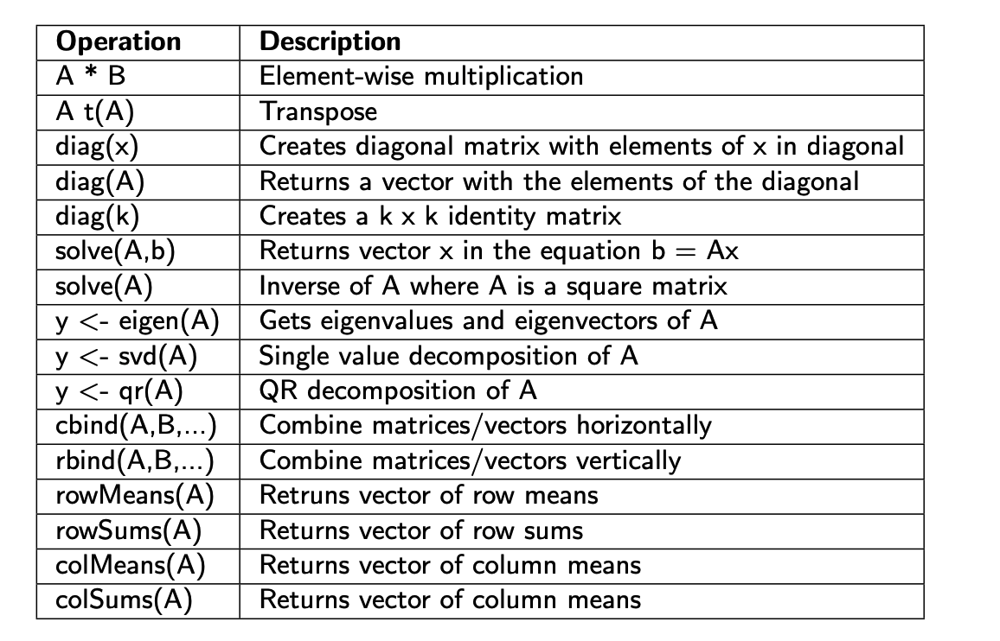

Let's talk about Factors.

- R supports factors which are a special data type for managing categories of data
- Identifying categorical variables is usually straightforward. These are the variables by which you might want to summarize some continuous data
- Categorical variables usually take on a definite number of values
- Many times R functions will convert character labels to factors by default but not always

- Storing data as factors insures that R modeling functions will treat such data correctly

Let’s say we have some automobile data that tells us if a car has an automatic transmission (0) or a manual transmission (1). We store this into a vector called transvec


```{r}
transvec <- c(1,1,1,0,0,0,0,0,0,0,0,0,0,0,0,0,0,1,1,1,0,0,0,0,0,1,1,1,1,1,1,1)
table(transvec) #How many are Auto and Manual ? Count 'em up. transvec
```

```{r}
# Make a vector of factors
mytransfac <- factor(transvec, 
                     levels = c(0,1), 
                     labels = c("Auto","Man") )

# Get the levels of the factor vector
levels(mytransfac)
 
mytransfac
```

R knows how to handle factors when doing plots. Here were get an X/Y plot and a Box Plot with very little work since R knows that mytransfac is a factor

```{r}
library(lattice)
xyplot(mpg~wt | mytransfac, 
       mtcars,
       main="MPG vs Weight - Auto and Manual Transmissions")

bwplot(~mpg|mytransfac, mtcars,
main="MPG - Auto and Manual Transmissions",layout=c(1,2))
```


## Aggregation Preview

With our knowledge of factors and vectors we can do some basic aggregation using the tapply command. We have a factor vector called mytransfac. Let’s summarize some MPG data that corresponds to the automobiles used in the mytransfac vector. So for each car we have its MPG figure and whether it has an automatic or manual transmission.

```{r}
mympg <- c(21,21,22.8,21.4,18.7,18.1,14.3,24.4,22.8,19.2,17.8, 16.4,17.3,15.2,10.4,10.4,14.7,32.4,30.4,33.9, 21.5, 15.5,15.2,13.3,19.2,27.3,26,30.4,15.8,19.7,15,21.4)

# tapply( continuous_value_to_summarize, factor_or_grouping variable, function_for_summary)
tapply(mympg, mytransfac, mean)
```

## The **cut** function

It is sometimes useful to take a continuous variable and chop it up into intervals or categories for purposes of summary or grouping. R has a function to do this called ”cut”to accomplish this.

Let’s work through some examples to understand what is going on. Let’s cut up the numbers between 0 and 10 into 4 distinct intervals

```{r}
cut(0:10,breaks=4)
```

```{r}
table(cut(0:10,breaks=4))
```

Well that was cool but since we are creating 4 intervals we should probably name them

```{r}
(my.cut <- cut(0:10,breaks=4,labels=c("Q1","Q2","Q3","Q4")))

```

```{r}
table(my.cut)
```

But you can to take finer-grained control over how the intervals are made.

```{r}
quantile(0:10)
```

```{r}
table(cut(0:10,breaks=quantile(0:10),include.lowest=TRUE))
```

Let’s summarize some exam scores according to a typical grading system

- F: < 60, 
- D: 60-70: 
- C: 70-80: 
- B: 80-90 
- A: 90-100

```{r}
set.seed(123)
exam.score <- runif(25,50,100) # Simulate some scores
cut(exam.score,breaks=c(0,60,70,80,90,100))
```

```{r}
cut(exam.score,breaks=c(50,60,70,80,90,100),labels=c("F","D","C","B","A"))
```
```{r}
my.table <- table(cut(exam.score,
                      breaks=c(0,60,70,80,90,100), 
                      labels=c("F","D","C","B","A")))
my.table
```

```{r}
barchart(my.table,main="Grade BarChart",col=terrain.colors(5))
```

- But the intervals don’t exactly match the grading scheme 
- A score of 90 will get a B when it should get an A
- Note the [ and ) characters show us if the interval boundary includes a score
- There is an argument that can help right)

```{r}
set.seed(123) 
cut(exam.score,breaks=c(50,60,70,80,90,100))
```

```{r}
cut(exam.score,breaks=c(50,60,70,80,90,100),right=F)
```

So if you don’t think that the cut command is cool then here is how you would have had to solve the problem - ughhh !

```{r}
set.seed(123)
exam.score <- runif(25,50,100)
acount <- 0
bcount <- 0
ccount <- 0
dcount <- 0
fcount <- 0
exam.score <- runif(25,50,100)
for (ii in 1:length(exam.score)) {
if (exam.score[ii] < 60) {fcount = fcount + 1} else
if ((exam.score[ii] >= 60) & (exam.score[ii] < 70)) {dcount = dcount + 1} else
if ((exam.score[ii] >= 70) & (exam.score[ii] < 80)) {ccount = ccount +1} else if ((exam.score[ii] >= 80) & (exam.score[ii] < 90)) {bcount = bcount +1} else
if ((exam.score[ii] >= 90) & (exam.score[ii] <= 100)) {acount = acount +1} }

cat("acount bcount ccount dcount fcount") 
cat(acount,bcount,ccount,dcount,fcount)
```

Sometimes we want our factors to be ordered. For example, we intuitively know that January comes before February and so on. Can we get R to create ordered factors ?

```{r}
mons <- c("Jan","Feb","Mar","Apr","May","Jun","Jan", "Feb","May","Jun", "Apr","Mar")
my.fact.mons <- factor(mons)

my.fact.mons[1] < my.fact.mons[2]
```

Sometimes we want our factors to be ordered. For example, we intuitively know that January comes before February and so on. Can we get R to create ordered factors ?

```{r}
my.fact.mons <- factor(mons, 
                       labels=c("Jan","Feb","Mar","Apr","May","Jun"),
                       ordered=TRUE)
my.fact.mons

my.fact.mons[1] < my.fact.mons

table(my.fact.mons) 

levels(my.fact.mons)
```

Let’s do an AOV on the mtcars data set variables MPG and number of gears the latter of which takes on the values 3,4,5. So it is well suited to be a factor.

```{r}
# Turn gear into a factor aov.ex1 = aov(mpg ~ gear,mtcars)
mtcars$gear <- factor(mtcars$gear) 
aov.ex1 = aov(mpg ~ gear,mtcars)
summary(aov.ex1)
```
Let’s do an AOV on the mtcars data set variables MPG and number of gears the latter of which takes on the values 3,4,5. So it is well suited to be a factor.

```{r}
# Tukey Multiple Comparisons my.tukey
(my.tukey <- TukeyHSD(aov.ex1,"gear"))
plot(my.tukey)
```

Differences between Gears are significant at the five percent level if the confidence interval around the estimation of the difference does not contain zero.

## Matrices

- Matrices are important mathematical structures for which R has excellent support

- Matrices are ideal for storing information on scientific data 

- Think of a matrix as being a vector with dimnensions 

- There are two common ways to create a matrix


1) Using the dim() function. You can think of the following vector as being a matrix with one row and twelve columns.

```{r}
myvec <- c(1:12)
```

To create, for example, a 3x4 matrix use the dim() function to adjust the dimensions of the vector

```{r}
dim(myvec) <- c(3,4) 
myvec
```

Note that columns are "filled" before rows. Note also that the requested dimension must make sense with the available number of elements

```{r eval=FALSE}
dim(myvec) <- c(5,4)
```
Using the matrix() function

```{r}
mymat <- matrix( c(7, 4, 2, 4, 7, 2), nrow=3, ncol=2)
```

You can use the nrow and ncol arguments to explicity specify the desired number of rows and columns. You can also request that the rows get filled first as opposed to the columns:

```{r}
mymat <- matrix( c(7, 4, 2, 4, 7, 2), nrow=3, ncol=2, byrow=TRUE) 
mymat
```

It is useful to name the rows and columns of matrices

```{r}
set.seed(123)
(X <- matrix(rpois(20,1.5),nrow=4))
```
Let’s say that these refer to four trials. We want to label the rows ”Trial.1”, ”Trial.2”, etc.

```{r}
rownames(X) <- paste("Trial",1:nrow(X),sep=".") 
X
```
We can something similar with the columns

```{r}
colnames(X) <- paste("P",1:ncol(X),sep=".")
X
```
We aren’t restricted to naming things according to a pattern

```{r}
drug.names <- c("aspirin","paracetamol","nurofen","hedex","placebo")
colnames(X) <- drug.names
X
```

Names provide an intutive way to index into a matrix structure

```{r}
X

X['Trial.1',] # Gets all columns for Trial 

X['Trial.1','nurofen']
```
It is more common to use numeric indexing especially if you are accessing parts of a matrix from a program


```{r}
set.seed(123)
X <- matrix(rpois(9,1.5),nrow=3) 
X
```


```{r}
X[1,1] 

X[2,2] 

X[3,3] 

diag(X)
```

Extracting information from a matrix is an important skill. Practice makes perfect

```{r}
X
    
X[1:2,1]

X[1:2,2]

X[1:2,]

```
Extracting information from a matrix is an important skill. Practice makes perfect

```{r}
X
      
X[,c(1,3)]   
 
X[,-2]
```
Remember that a matrix is just a vector with dimensions so you could index into a matrix using single bracket notation.

```{r}
X
     
X[1:4]

X >= 2
       
X[X >= 2]   # Returns which values are greater or equal to 2
 
which(X >= 2) 
```

Remember that a matrix is just a vector with dimensions so you could index into a matrix using single bracket notation.

```{r}
X %% 2 == 0    
```

```{r}
X[X %%2==0] 
```

Remember that a matrix is just a vector with dimensions so you could index into a matrix using single bracket notation.

```{r}
X

X[X%% 2==0]<-99

```

There are two functions called row and col that return the numeric row and column, respectively of the matrix.

```{r}
X

row(X)

col(X)
```
There are two functions called row and col that return the numeric row and column, respectively of the matrix.

```{r}
row(X) == col(X)
```

```{r}
X[row(X) == col(X)]
```
```{r}
X[row(X) == col(X)] <- 0
```


### Matrices - rbind/cbind

Sometimes we need to add rows and columns to a matrix. There are two commands to do this: rbind and cbind.

```{r}
set.seed(123)
X <- matrix(rpois(9,1.5),nrow=3)
colnames(X) <- c("aspirin","paracetamol","nurofen") 
rownames(X) <- paste("Trial",1:3,sep=".")
rbind(X,Trial.4=c(4,7,5))
```

Binding columns works pretty much the same way:

```{r}
X
        
rowSums(X)

cbind(X,rowsums = rowSums(X))
```

Let’s look at some examples involving calculations on matricies:

```{r}
set.seed(123)
X <- matrix(rpois(9,1.5),nrow=3)
colnames(X) <- c("aspirin","paracetamol","nurofen") 
rownames(X) <- paste("Trial",1:3,sep=".")
X
```

```{r}
mean(X[,3]) # Mean of the 3rd column [1] 1.666667
var(X[3,]) # 
```

There are functions optimized specifcally for use with matrices. They are very fast and work well on large matrices

```{r}
X

rowSums(X)

colSums(X)
```

There are functions optimized specifcally for use with matrices. They are very fast and work well on large matrices. However be careful if the matrix has missing data in wich case you will need to include the na.rm=TRUE arguement.

```{r}
rowMeans(X)

colMeans(X,na.rm=TRUE)

colMeans(X)[3]
```

There are functions optimized specifcally for use with matrices. They are very fast and work well on large matrices. However be careful if the matrix has missing data in wich case you will need to include the na.rm=TRUE arguement.

```{r}
X[1,2] <- NA 
X

colMeans(X)
colMeans(X, na.rm=TRUE)
```

There is a function called apply which simplifies looping over the rows or columns of a matrix. The“apply family”of functions is important in R.

```{r}
X
```
```{r}
apply(X,1,range)
```

```{r}
apply(X,2,range) 
```
R supports common linear algebra operations

```{r}
A = matrix(c(1,3,2,2,8,9),3,2)
A
t(A)
```

```{r}
A

diag(A)

diag(c(1,2,3))

diag(1,4)
```
The inverse of a n x n matrix A is the matrix B (which is also n x n) that when multiplied by A gives the identity matrix

```{r}
(A <- matrix(1:4,2,2))
```

```{r}
(B = solve(A))
```

```{r}
A %*% B
```

Eigen values/vectors show up a lot in math - like with Principal Components

```{r}
url <- "https://raw.githubusercontent.com/steviep42/youtube/master/YOUTUBE.DIR/wines.csv"
my.wines <- read.csv(url, header=T)
my.scaled.wines <- scale(my.wines[,-1]) # Scale the data
my.cov <- cor(my.wines[,-1]) 
my.eigen <- eigen(my.cov)
```


```{r}
options(digits=3)
my.eigen
```

Eigen values/vectors show up a lot in math - like with Principal Components. The loadings dervied in the previous slide are the principal componenents

```{r}
(loadings <- my.eigen$vectors)

(scores <- my.scaled.wines %*% loadings)
```

Matrices are also used a lot in cluster analysis. Let’s look at a matrix of 32 cars and attempt to cluster them according to their various attributes such as MPG, Number of Cylinders, Gears, Weight, etc. This data set (mtcars) is internal to R so you can refer to it easily.

```{r}
head(mtcars)
```
We first compute a distance between the rows and then cluster them.

```{r}
hc <- hclust(dist(mtcars[,2:11])) 
plot(hc, hang = -1,cex=0.7)
```

We can create matrices using the replicate command
Useful when doing repeated sampling activity like bootstrapping

```{r}
replicate(4,rnorm(5))
some.population <- rnorm(1000) 
replicate(4,sample(some.population, 5, replace=TRUE))
```

Here are some Matrix functions:



## Lists

Lists provide a way to store information of different types within a single data structure

Remember that vectors and matrices restrict us to only one data type at a time.
That is we cannot mix, for example, characters and numbers within a vector or matrix.

Many functions in R return information stored in lists

Consider the following example wherein we store information about a family. Not all this information is of the same type

```{r}
family1 <- list(husband="Fred", 
                wife="Wilma", 
                numofchildren=3, 
                agesofkids=c(8,11,14))

 length(family1)  # Has 4 elements
 
 family1
 
 str(family1)
```

If possible, always create named elements. It is easier for humans to index into a named list

```{r}
family1 <- list(husband="Fred", 
                wife="Wilma", 
                numofchildren=3, 
                agesofkids=c(8,11,14))
 # If the list elements have names then use "$" to access the element
family1$agesofkids
```

If the list elements have no names then you have to use numeric indexing

```{r}
(family2 <- list("Barney","Betty",2,c(4,6)))
```
```{r}
family2 <- list("Barney","Betty",2,c(4,6))

family2[4] # Accesses the 4th index and associated element

family2[[4]] # Accesses the 4th element value only - more direct

family2[3:4] # Get 3rd and 4th indices and associate values

```

As newcomers to R we usually doesn’t create lists except in two major cases:

1) We are writing a function that does some interesting stuff and we want to return to the user a structure that has information of varying types

2) As a precursor to creating a a data frame, which represents a hybrid object with characteristics of a list and a matrix

As an example of the first case, R has lots of statistical functions that return lists of information.


```{r}
data(mtcars) # Load mtcars into the environment 
mylm <- lm(mpg ~ wt, data = mtcars)
print(mylm)
```

But there is a lot more information

```{r}
str(mylm,attr=FALSE)
```

```{r}
names(mylm)

mylm$effects

lm(mpg ~ wt, data = mtcars)$coefficients
```

Some other basic R functions will return a list - such as some of the character functions:

```{r}
mystring <- "This is a test" 
mys <- strsplit(mystring, " ")
str(mys)

```

```{r}
mys[[1]][1]

mys[[1]][1:2]

unlist(mys)
```
When we create our own functions we can return a list

```{r}
my.summary <- function(x) { 
  return.list <- list() 
  return.list$mean <- mean(x) 
  return.list$sd <- sd(x) 
  return.list$var <- var(x) 
  return(return.list)
}
```


```{r}
my.summary(1:10)
```

Remember the sapply command ? We use it to apply a function over each element of a list or a vector. This helps us avoid having to write a "for-loop" every time we want to process a list or a vector.

```{r}
family1 <- list(husband="Fred", 
                wife="Wilma", 
                numofchildren=3, 
                agesofkids=c(8,11,14))

sapply(family1,class)
```


```{r}
sapply(family1,length)
```

sapply tries to return a "simplified" version of the output (either a vector or matrix) hence the ”s”in the ”sapply”. If you don’t use something like sapply then the example on the previous slide would look this:

```{r}
family1 <- list(husband="Fred", 
                wife="Wilma", 
                numofchildren=3, 
                agesofkids=c(8,11,14))

 for (ii in 1:length(family1)) {
    cat(names(family1)[ii]," : ",class(family1[[ii]]),"\n")
}
```

Similar to sapply, the lapply function let’s you“apply”some function over each element of a list or vector. It will return a list version of the output hence the“l”in the“lapply”. So deciding between sapply and lapply simply is a question of format. What do you want back ? A vector or list ? Most of the time I use sapply.

```{r}
# lapply( vector_or_list, function_to_apply_to_each element)
family1 <- list(husband="Fred", 
                wife="Wilma", 
                numofchildren=3, 
                agesofkids=c(8,11,14))

lapply(family1,class)
```
check out the following:

```{r}
lapply(family1,mean)
```

We can write our own processing function that checks to see if the list element is valid input for the mean function.

```{r}
my.func <- function(x) { if(class(x)=="numeric") {
    return(mean(x))
  }
}
lapply(family1, my.func)
```

