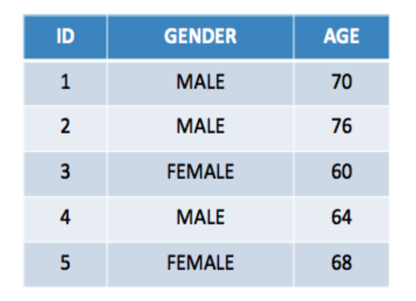
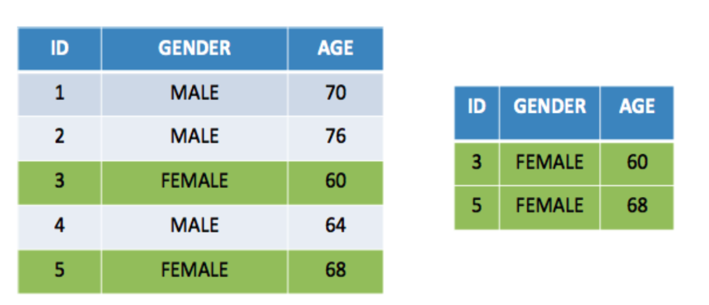
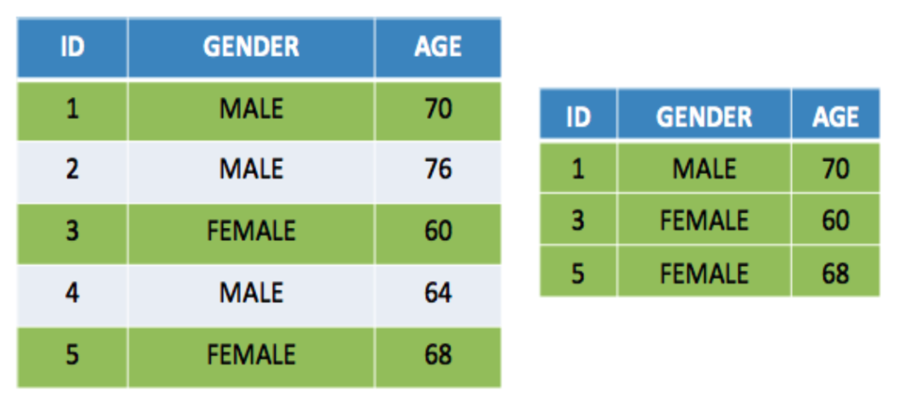
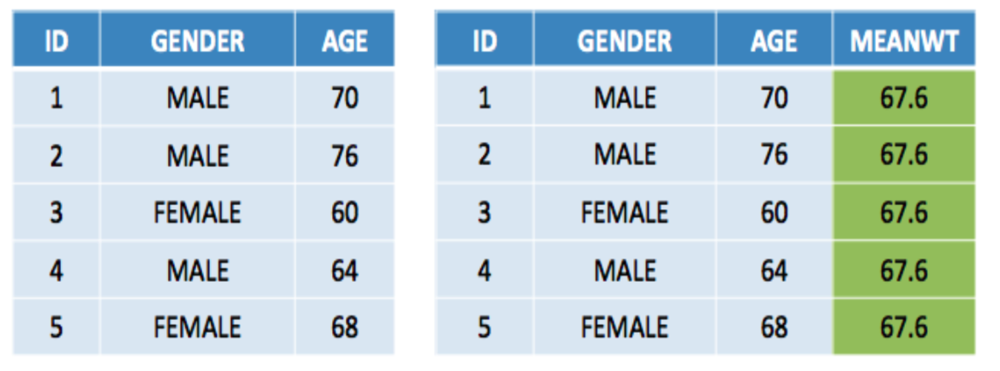
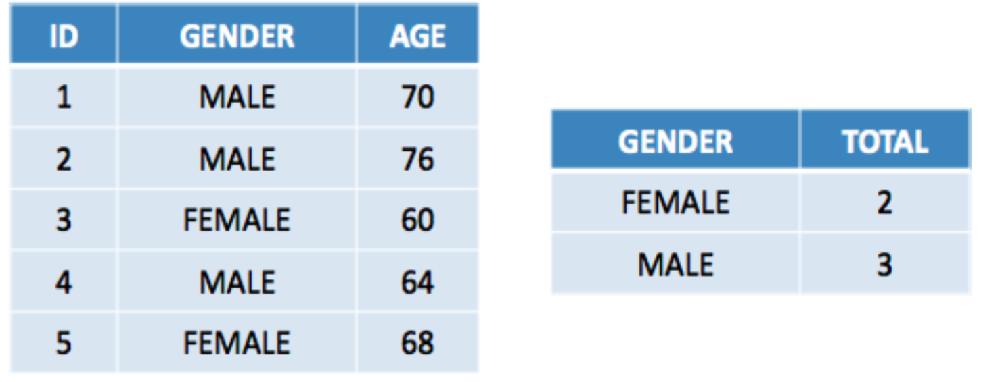
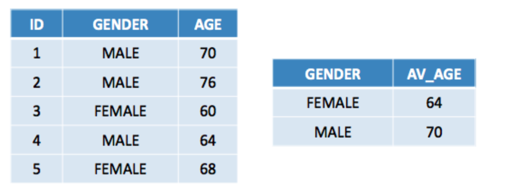
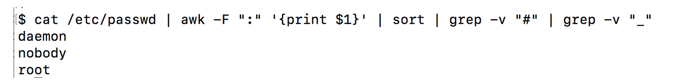
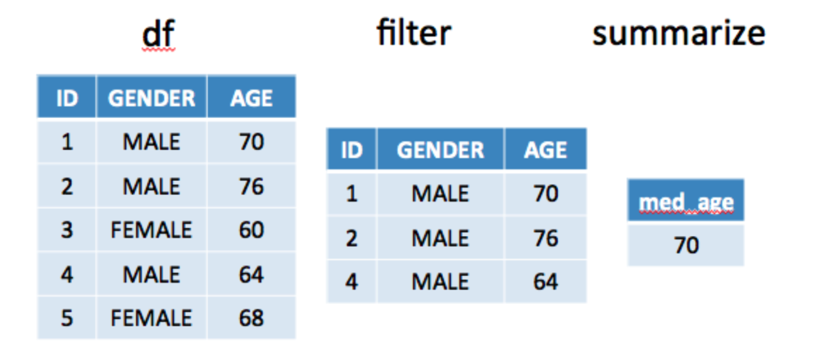

`Data Aggregation:` The process of taking some data and putting it into a form that lends itself easily to summary, e.g. replace groups of observations with summary statistics.

`Data Restructuring:` Change the structure of the data so that its new form is more convenient for a specific purpose (usually analysis).

R has many ways to do either. Before you start writing code to do some of these activities check around to see what functions exist. Chances are there are some good tools available. We will explore many of them in this session.


Command  | Purpose
------------- | -------------
table, xtabs  | Create Contingency Tables
tapply, split  | Summarize a continuous variable by a grouping variables 
aggregate | Summarize continuous variable(s) by  grouping variables
dplyr | Split, Apply, Combine

## Counting

One of the most basic forms of aggregation is to put things into tables for easy counting. This is usually done with categorical variables to obtain "count" information. We can then do things like Chi-Square tests.

```{r}
letters[1:10]                   # Built in letters char vector

my.sample <- sample(letters[1:10],50,replace=TRUE) 

table(my.sample)
```

We can "flip" a coin 100,000 times to see if its a fair coin

```{r}
n <- 100000
coin_flips <- sample(c("Heads","Tails"),100000,T)

# Make a table
coin_tab <- table(coin_flips)
barplot(coin_tab)

# Fair coin?
chisq.test(coin_tab)

```

Un Fair Coin ? 

```{r}
n <- 100000
coin_flips <- sample(c("Heads","Tails"),100000,T,prob=c(.65,.35))

# Make a table
coin_tab <- table(coin_flips)
barplot(coin_tab)

# Fair coin?
chisq.test(coin_tab)


```

However, we usually create tables out of a data frame that contains some categories or factors. Using the popular mtcars data set let's find out how many 4,6,8 and cylinder cars there are for each category of transmission (auto or manual).

```{r}
table(transmission=mtcars$am,cylinder=mtcars$cyl)
```

We might want to make factors more obvious

```{r}
mtcars <- transform(mtcars,am=factor(am,labels=c("A","M")))
table(mtcars$am,mtcars$cyl)
plot(table(mtcars$am,mtcars$cyl),main="Counts for Cylinder Group",
        ylab="Number of Cars",xlab="cylinder Groups")
```

```{r}
par(mfrow=c(1,2))

my.table <- table(mtcars$am,mtcars$cyl)

barplot(my.table,legend=T,col=c("red","blue","green"),
          xlab="Transmission Type",ylim=c(0,20))


# Here we get a Mosaic Plot

plot(my.table,col=c("red","blue","green"),main="Mosaic Plot",
      xlab="Trans Type", ylab="Number of Gears")

```

Remember that we can take continuous variables and turn them into categories.

```{r}
my.cut <- cut(mtcars$mpg,breaks=4,labels=c("Bad","Not Good","Good","Great"))

my.cut

mtcars$cyl <- factor(mtcars$cyl,labels=paste("Cyl",seq(4,8,2),sep="_"))

table(MPG=my.cut,mtcars$cyl)
```

## xtabs

This wouldn’t be R unless there were some other function that does pretty much the same thing as table. There is another function called "xtabs". Some people feel that it is superior to the table function because it supports a formula interface when creating tables. The formula interface requires the "+" symbol to be on the right of any grouping variable.

```{r}
xtabs(~am+cyl,mtcars)     # Transmission type by number of cylinders

```

```{r}
xtabs(~cyl+am,mtcars)     # Number of cylinders by transmission type

```

## tapply summarize continuous quantities by categories

Up until now we’ve been working with tables created from categorical variables. Even in our example that used a continuous variable we wound up using the cut command to group the continuous variables into categories. 

```{r}
tapply(mtcars$mpg, mtcars$am, mean)
#
```


```{r}
tapply(mtcars$mpg, list(mtcars$am, mtcars$vs),mean)
```

Note that we can supply our own function when using tapply. The function in this example is used to generate the standard error.  This is what we call an anonymous function since we don’t even bother to give it a name.  It just exists only for the duration of the call to tapply. 

```{r}
myFunc <- function(x) {
    se = (sqrt(var(x)/length(x)))
    return(se)
}

#tapply(mtcars$mpg, list(mtcars$am, mtcars$vs), myFunc)  
tapply(mtcars$mpg, list(mtcars$am,mtcars$cyl),myFunc)
```

## The Split function

```{r}
mysplit <- split(mtcars,mtcars$cyl)
```

While the split command isn't specifically associated with aggregation it can be used to rapidly separate a data frame based on a factor. It the creates a list wherein each element of the list contains that portion of the data frame corresponding to a value of the factor. In the previous example we create a three element list with each element being the part of the data frame corresponding to 4,6, or 8 cylinders.

```{r}
my_summary <- sapply(mysplit,function(x) mean(x$mpg))
```

## Aggregate Command

```{r}
aggregate(mtcars['mpg'],list(Transmission=mtcars$am),mean)
```

```{r}
aggregate(mtcars[c('mpg','hp')],list(Transmission_Type=mtcars$am),mean)

```


```{r}
aggregate(mtcars[c('mpg','hp')],
          list(Transmission_Type = mtcars$am,
          Cylinders = mtcars$cyl),mean)
```


The aggregate command also has a formula interface if you find that to be more convenient. Many do since it gives you an argument to specify the data frame you are trying to summarize. This saves typing.


```{r}
aggregate(mpg ~ am, mtcars, mean)

aggregate(mpg ~ am + cyl, mtcars, mean)

```

We can actually reduce things down further if we want. In effect we are trying to further simplify the table. 

```{r}
(myagg <- aggregate(mpg ~ am + cyl, mtcars, mean))

# Let's reduce this further. 

xtabs(mpg~am+cyl,myagg)
```

## dplyr and the tidyverse

dplyr is an add on package designed to efficiently transform and summarize tabular data such as data frames. The package has a number of functions ("verbs") that perform a number of data manipulation tasks:

 * Filtering rows
 * Select specific columns 
 * Re-ordering or arranging rows
 * Summarizing and aggregating data

One of the unique strengths of dplyr is that it implements what is known as a Split-Apply-Combine technique that we will explore in this session. dplyr is part of the tidyverse package:


The dplyr package is part of the larger [tidyverse package](https://www.tidyverse.org/) set which has expanded considerably in recent years and continues to grow in size and utility such that many people never learn the “older way” of doing things in R. But we’ve already been through that in the previous section. The tidyverse has the following packages. The descriptions have been lifted from the tidyverse home page.

**ggplot2** - ggplot2 is a system for declaratively creating graphics, based on The Grammar of Graphics. You provide the data, tell ggplot2 how to map variables to aesthetics, what graphical primitives to use, and it takes care of the details.

**dplyr** - dplyr provides a grammar of data manipulation, providing a consistent set of verbs that solve the most common data manipulation challenges.

**tidyr** - tidyr provides a set of functions that help you get to tidy data. Tidy data is data with a consistent form: in brief, every variable goes in a column, and every column is a variable.

**readr** - readr provides a fast and friendly way to read rectangular data (like csv, tsv, and fwf). It is designed to flexibly parse many types of data found in the wild, while still cleanly failing when data unexpectedly changes.

**tibble** - tibble is a modern re-imagining of the data frame, keeping what time has proven to be effective, and throwing out what it has not. Tibbles are data.frames that are lazy and surly: they do less and complain more forcing you to confront problems earlier, typically leading to cleaner, more expressive code.

**stringr** - stringr provides a cohesive set of functions designed to make working with strings as easy as possible. It is built on top of stringi, which uses the ICU C library to provide fast, correct implementations of common string manipulations.

**lubridate** - Date-time data can be frustrating to work with in R. R commands for date-times are generally unintuitive and change depending on the type of date-time object being used. Moreover, the methods we use with date-times must be robust to time zones, leap days, daylight savings times, and other time related quirks. Lubridate makes it easier to do the things R does with date-times and possible to do the things R does not.


A handy reference for dplyr can be [found here](https://github.com/rstudio/cheatsheets/blob/master/data-transformation.pdf)

```{r}
# install the package

# install.packages("dplyr")
# install.packages("readr")    # Get's the equivalent to data.table's fread package

# You could load the entire tidyverse or just parts of it

# library(tidyverse)
suppressMessages(library(dplyr))       

# Launches a browser to explore
# browseVignettes(package = "dplyr")  
```

## dplyr verbs 

There are some common activities associated with a data frame:

  filter - find observations satisfying some condition(s)

  select - selecting specific columns by name 

  mutate - adding new columns or changing existing ones 

  arrange - reorder or sort the rows 

  summarize - do some aggregation or summary by groups

```{r}
df <- data.frame(id = 1:5,
                 gender = c("MALE","MALE","FEMALE","MALE","FEMALE"),
                 age = c(70,76,60,64,68))
df
```



### Filter is for finding rows that satisfy certain criteria 

```{r}
filter(df,gender == "FEMALE")

filter(df, id %in% c(1,3,5))

```

Equivalent to:

```{r}
filter(df, id == "1")
```



So, now find only the ids that relate to rows 1,3, or 5. This is a highly specialized search but it is helpful to show that you can use a wide variety of logical constructs.

```{r}
filter(df, id %in% c(1,3,5))
```




### mutate is for changing columns or adding new ones

```{r}
mutate(df,meanage = mean(age))

mutate(df,old_young=ifelse(df$age>=mean(df$age),"Y","N"))
```



Next we will create a new column designed to tell us if a given observation has an age that is greater than or equal to the average age. Specifically, create a variable called old_young and assign a value of “Y” if the observed age for that row is above the mean age and a value of “N” if it is not.

```{r}
tmp <- mutate(df, color = ifelse(age > mean(age),"red","blue"))

plot(tmp$age,col=tmp$color,type="p",pch=19,main="Ages",ylab="Age")

grid()

abline(h=mean(tmp$age),lty=2)

legend("topright",c("Above Avg","Below Avg"),col=c("red","blue"),pch=19)
```

### Use arrange for sorting the data frame by a column(s)

```{r}
# Sort df by age from highest to lowest

arrange(df, desc(age))
  

# Sort df by gender (alphabetically) and then by age 
# from highest to lowest

arrange(df, gender,desc(age))
  
```

### Select allows us to select groups of columns from a data frame

```{r}
select(df,gender,id,age)  # Reorder the columns
  
select(df,-age)   # Select all but the age column
 
select(df,id:age)  # Can use : to select a range
```


```{r}
df
  
group_by(df,gender)   # Hmm. Did this really do anything ?


```

Actually, it does but until it is paired with a summarize it does not become apparent

```{r}
summarize(group_by(df,gender),total=n())
```




```{r}
summarize(group_by(df,gender),av_age=mean(age))
```



```{r}
summarize(group_by(df,gender),
          av_age=mean(age),
          total=n())
```

But do you really need dplyr to do this ? No but it makes it a lot easier

```{r}
df

tapply(df$age,df$gender,mean)    # tapply function

aggregate(age~gender,data=df,mean) # aggregate works also
 
lapply(split(df,df$gender),function(x) mean(x$age)) # complicated

```

## Pipes


While what we have done with dplyr up until now is useful, it still might not be apparent how it could "replace" the native R commands. And in fact, you might not want to replace it. But the use of **pipes** makes a compelling case to do so.

Let us consider the `pipe` operator that is included with the tidyverse. This is used to make it possible to ``pipe'' the results of one command into another command and so on. 

The inspiration for this comes from the UNIX/LINUX operating system where pipes are used all the time. So in effect using ``pipes'' is nothing new in the world of research computation.

Once you get used to pipes it is hard to go back to not using them. The inspiration for this comes from the UNIX/LINUX operating system where pipes are used all the time. So in effect using "pipes" is nothing new in the world of research computation. The concept goes back decades.


```{r eval=FALSE}
cat /etc/passwd | awk -F ":" '{print $1}' | sort | grep -v "#" | grep -v "_"
```


So this is the traditional way of using functions in R. We use the composite function approach which uses something like f(g(x)) where in this case, g(x) is represented by the select function and f(x) is the head function. 

```{r}
head(select(mtcars, mpg, am))
 
```

Here we will select the mpg and am column from mtcars and view the top 5 rows but using dplyr and the piping operator. Instead of nesting functions (reading from the inside to the outside), the idea of of piping is to read the functions from left to right. In effect we have a "stream" of data flowing from left to right which could be filtered, mutated, arranged or grouped. 

```{r}
mtcars %>% select(mpg, am) %>% head
```

The key to understanding how this works is to read this from left to right. It bears repeating that each command is "its own thing" independently of the pipe character. So the:

1. output of mtcars goes into the 
2. input of the **select** function whose output goes into the
3. input of the **head** function


## Split-Apply-Combine

Let’s use our new found knowledge to re-imagine our use of the group_by and summarize functions that we have been using in composite form up until now. What about this ? We can chain together the output of one command to the input of another !

```{r}
df %>% group_by(gender) %>% summarize(avg=mean(age)) 
```

```{r}
df %>% group_by(gender) %>% summarize(avg=mean(age),total=n()) 

# Same as the following but the pipes don't require you to "commit"
# With the following, you have to know in advance what you want to do

summarize(group_by(df,gender), avg=mean(age))
```

What is the median age of all males ?

```{r}
df %>% filter(gender == "MALE") %>% summarize(med_age=median(age))
```



It should be observed that if you want to save the results of some sequence of commands that you will need to use the "<-" operator. Using the previous example we could the following to save our result.

```{r}
results <- df %>% 
  filter(gender == "MALE") %>% 
  summarize(med_age=median(age)) 
```

Using the built in mtcars data frame filter out records where the wt is greater than 3.3 tons. 

Then create a column called ab_be (Y or N) that indicates whether that observation's mpg is greater (or not) than the average mpg for the filtered set. 

Then present the average mpg for each group

```{r}
mtcars %>% 
  filter(wt > 3.3)  %>% 
  mutate(ab_be=ifelse(mpg > mean(mpg),"Y","N")  ) %>% 
  group_by(ab_be) %>% 
  summarize(mean_mpg=mean(mpg))
      
```

Using the built in mtcars dataframe filter out records where the wt is greater than 3.3 tons.

```{r}
mtcars %>% filter(wt > 3.3)
```


Create a column called ab_be (Y or N) that indicates whether that observation's mpg is greater (or not) than the average mpg for the filtered set.

```{r}
mtcars %>% filter(wt > 3.3) %>% 
           mutate(ab_be=ifelse(mpg > mean(mpg),"Y","N")) 
```

Then present the average mpg for each group as defined by ab_be

```{r}
mtcars %>% 
         filter(wt > 3.3)  %>% 
         mutate(ab_be=ifelse(mpg > mean(mpg),"Y","N")) %>% 
         group_by(ab_be) %>% 
         summarize(mean_mpg=mean(mpg))

```

This could be then "piped" into the input of the ggplot command to plot a corresponding bar chart. Both ggplot and dplyr are part of the tidyverse which means that the two packages “talk” to each other well.


```{r}
library(ggplot2)
mtcars %>% filter(wt > 3.3)  %>% 
         mutate(ab_be=ifelse(mpg > mean(mpg),"Y","N")  ) %>% 
         group_by(ab_be) %>% summarize(mean_mpg=mean(mpg)) %>%
         ggplot(aes(x=ab_be,y=mean_mpg)) + geom_bar(stat="identity") +
         ggtitle("Mean MPG") + labs(x = "ab_be", y = "Mean MPG")
```

Other activities are possible


```{r}
mtcars %>% sample_n(2) # Sample 2 records from a data frame
```

Note that we could do something like:

```{r}
mtcars %>% group_by(cyl) %>% sample_n(2)
```

## Wages

Remember last week when we spent a lot of time with the wages data frame as part of our introduction to ggplot2. Let's see how we might work with this using dplyr.

```{r}
url <- "https://raw.githubusercontent.com/pittardsp/bios545r_spring_2018/master/SUPPORT/wage.csv"

library(readr)

wage <- read_csv(url)
glimpse(wage)
```
```{r}
sapply(wage,n_distinct)
```


```{r}
summary(wage)
```

Do some basic aggregations:

```{r}
# What is the average wage across JobClass ? 

wage %>% group_by(jobclass) %>% summarize(avg_salary=mean(wage))
```


```{r}
# What is the average wage across healt ins ? Present the result in descending 
# order of salary
#race
wage %>% group_by(health_ins) %>% 
  summarize(mean_salary=mean(wage)) %>% 
  arrange(desc(mean_salary)) 
```

What is the average wage across health insurance and education ? Present the result in descending order of salary and show only the top 3 mean salaries

```{r}

wage %>% group_by(health_ins,education) %>% 
  summarize(mean_salary=mean(wage)) %>% 
  arrange(mean_salary) 
```

Create a graph of the top three mean salaries by Education level 
as grouped by Marital Status ? Notice anything interesting ? 

```{r}
wage %>% group_by(education,maritl) %>% 
  summarize(mean_salary=mean(wage)) %>% 
  arrange(desc(mean_salary)) %>% 
  ggplot(aes(x=education,y=mean_salary,fill=maritl)) + geom_bar(stat="identity") +
  ggtitle("Mean Salary by Education by Marital Status")
```

Let's group the ages into 4 categories based on where the age is "binned" into
the percentiles. 

```{r}
labs <- c("young_adult","adult","middle_aged","older")

wage <- wage %>% mutate(age_cat=cut(age,labels=labs,breaks=quantile(age)))
```

Now let's look at the barplot of mean salary by education and age_cat 


```{r}
wage %>% group_by(education,age_cat) %>% 
  summarize(mean_salary=mean(wage)) %>% 
  arrange(desc(mean_salary)) %>% 
  ggplot(aes(x=education,y=mean_salary,fill=age_cat)) + geom_bar(stat="identity") +
  ggtitle("Mean Salary by Education by Age Category")

```

Let's look at the distribution of salary as grouped by age category

```{r}
wage %>% ggplot(aes(x=wage)) + geom_histogram(aes(fill=age_cat)) 
```

Let's look at the distribution of salary as grouped by age category but
let's use facets this time 

```{r}
wage %>% ggplot(aes(x=wage)) + 
  geom_histogram() + 
  facet_wrap(~age_cat)
```

It might be better to first filter out any rows with missing data

```{r}
wage %>% na.omit() %>% 
  ggplot(aes(x=wage)) + 
  geom_histogram() + 
  facet_wrap(~age_cat)
```

## Window Functions

There are functions that let us look over a range of values for a column of a data frame. For example, consider the following data:

```{r}
months1 <- factor(month.abb,ordered=TRUE,levels=month.abb)
set.seed(123)
amount <- 1:12 + sample(c(-.5,.5),1)
(figures <- data.frame(months=months1,amount=amount))
```

What if we wanted to find the percent change in the **amount** variable from one month to the next ? A possible formula for computing the change might look like: 

# change = (current amount - previous amount) / previous amount

Let's write a function to implement this:

```{r}
amount_change <- function(df=figures,col=2) {
# function to compute percent change in amount
# INPUT: df - a data frame
#        col - the column number corresponding to the amount
#
# OUTPUT: a dataframe (the same as df) with the change column 
#         added to it
#

  # Check to see if specified column is numeric
  if (!is.numeric(df[,col])) {
    stop("Specified column is not numeric. Bye!")
  }
  # Setup an empty vector   
  change <- vector()
     
  for (ii in 1:nrow(df)) {
    if (ii == 1) {
       change[ii] <- NA
    } else {
       change[ii] <- (df[ii,col] - df[(ii-1),col])/df[(ii-1),col]
    }
  } # end for loop`
  
  return(cbind(df,change))
} # end function
```

```{r}
amount_change()
```

But that was a lot of work wasn't it ? What about using the **lag** function from dplyr which allows us to refer to a previous value in a vector of information.

```{r}
figures$amount
lag(figures$amount)
```
So using this information along with a formula for computing the change using the **lag** function.

```{r}
figures %>% mutate(change = (amount-lag(amount))/lag(amount))

```


